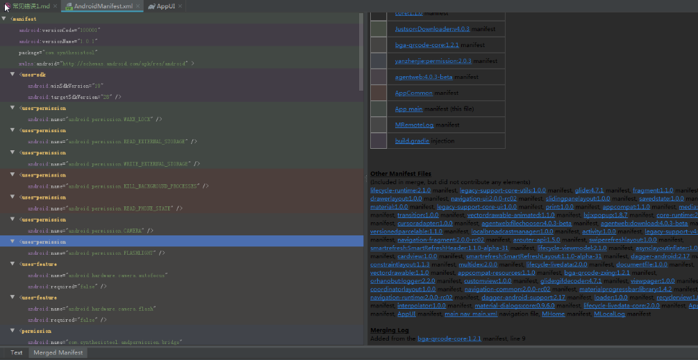

1. Manifest merger failed with multiple errors, see logs

  1.在terminal中输入 
  gradlew processDebugManifest --stacktrace

  2.打开主模块的AndroidManifest.xml,下方可以看到MergedManifest,点击会打开如下如所示界面，可以找到右侧
  描述error,找到对应错误信息进行解决
  