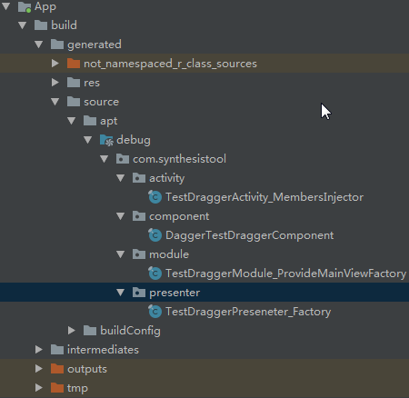

####  代码流程

1. 在基本使用篇配置中后，通过rebuild project会生成日下代码



2. 
```
DaggerTestDraggerComponent.builder()
                .testDraggerModule(new TestDraggerModule(this))
                .build()
                .inject(this);

```  

1.  通过builder模式构建DaggerTestDraggerComponent对象并让该对象持有Module对象。
```  
public static final class Builder {
    private TestDraggerModule testDraggerModule;

    private Builder() {} 
    
    public TestDraggerComponent build() {
      if (testDraggerModule == null) {//强制在调用build方法前必须有不为null的xxxModule类，否则抛出运行时异常并提示用户xxxModule must be set
        throw new IllegalStateException(TestDraggerModule.class.getCanonicalName() + " must be set");
      }
      return new DaggerTestDraggerComponent(this);
    }

    public Builder testDraggerModule(TestDraggerModule testDraggerModule) {
      this.testDraggerModule = Preconditions.checkNotNull(testDraggerModule);
      return this;
    }
  }  
```       

2.  对象注入流程  
``` 
  public void inject(TestDraggerActivity activity) {
    injectTestDraggerActivity(activity);    [Windows/Mac/Linux 全平台客户端](-)
  }

  private TestDraggerActivity injectTestDraggerActivity(TestDraggerActivity instance) {
    TestDraggerActivity_MembersInjector.injectMTestDraggerPreseneter(instance, getTestDraggerPreseneter());
    return instance;
  }
  
  private TestDraggerPreseneter getTestDraggerPreseneter() {
    return TestDraggerPreseneter_Factory.newTestDraggerPreseneter(
        TestDraggerModule_ProvideMainViewFactory.proxyProvideMainView(testDraggerModule));
  }
 ``` 